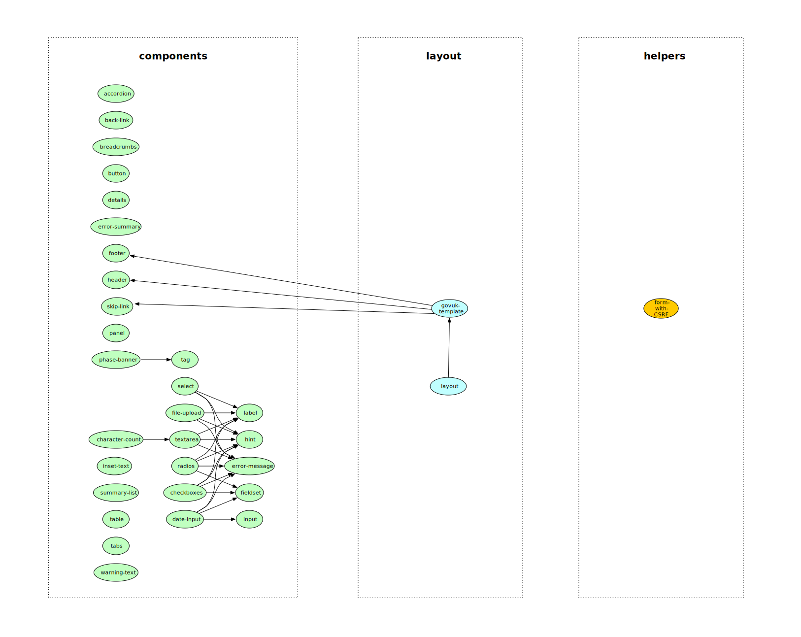

# play-frontend-govuk


> Twirl implementation of the [govuk-frontend](https://github.com/alphagov/govuk-frontend/) components library as 
  documented in the [GOV.UK Design System](https://design-system.service.gov.uk/components/). 

__This is a work in progress and for the time being we will be releasing versions 0.x.y which may have breaking changes.__


## Table of Contents

- [Background](#background)
- [Getting Started](#getting-started)
- [Usage](#usage)
- [API](#api)
- [Dependencies](#dependencies)
- [Contributing](#contributing)
- [Useful Links](#useful-links)
- [Owning Team Readme](#owning-team-readme)
- [License](#license)

## Background

This library provides accessibility-compliant `Twirl` basic building blocks as originally implemented in the [govuk-frontend](https://github.com/alphagov/govuk-frontend/)
library. Additionally, it provides a layout that wraps the `GovukTemplate`, used across all frontends, and we plan to 
include more helpers built on top of `Play's` own helpers and the basic components.
The following figure illustrates the components and their dependencies (zoom in for a better view).



## Getting started
1>  Add [Twirl](https://github.com/hmrc/play-frontend-govuk/releases) library in the App dependencies.
```sbt
//build.sbt for Play 2.5
libraryDependencies += "uk.gov.hmrc" %% "play-frontend-govuk" % "x.y.z-play-25"
//or Play 2.6
libraryDependencies += "uk.gov.hmrc" %% "play-frontend-govuk" % "x.y.z-play-26"
```

2>  Add SASS assets to app/assets/stylesheets in application.scss to inherit / extend GovUk style assets / elements, e.g.:
```
$govuk-assets-path: "/<your-project-context-root>/assets/lib/govuk-frontend/govuk/assets/";

@import "lib/govuk-frontend/govuk/all";

.app-reference-number {
  display: block;
  font-weight: bold;
}
```
Ensure [sbt-sassify](https://github.com/irundaia/sbt-sassify) is added to plugins.sbt

3>  Add govuk-frontend routing redirection in app.routes:
```scala
->         /govuk-frontend                      govuk.Routes
```

4>  Add TwirlKeys.templateImports in build.sbt:
```sbt
    TwirlKeys.templateImports ++= Seq(
      "uk.gov.hmrc.govukfrontend.views.html.components._",
      "uk.gov.hmrc.govukfrontend.views.html.helpers._"
    )
```

5>  Use GovukLayout from library to create standard views out of the box
```scala
@govukLayout(
    pageTitle = pageTitle,
    headBlock = Some(head()),
    beforeContentBlock = beforeContentBlock,
    footerItems = Seq(FooterItem(href = Some("https://govuk-prototype-kit.herokuapp.com/"), text = Some("GOV.UK Prototype Kit v9.1.0"))),
    bodyEndBlock = Some(scripts()))(contentBlock)
```

### Using govuk-frontend Components in Twirl
To use the [govuk-frontend](https://github.com/alphagov/govuk-frontend/) `Twirl` [components](https://github.com/hmrc/play-frontend-govuk/blob/master/src/main/play-26/uk/gov/hmrc/govukfrontend/views/html/components/package.scala) 
and all the [types](https://github.com/hmrc/play-frontend-govuk/blob/master/src/main/scala/uk/gov/hmrc/govukfrontend/views/Aliases.scala) needed to construct them, import the following:
```scala
@import uk.gov.hmrc.govukfrontend.views.html.components._
```

### Twirl HTML helper methods and implicits
The above import will also bring into scope the available `Twirl` [helpers](https://github.com/hmrc/play-frontend-govuk/blob/master/src/main/play-26/uk/gov/hmrc/govukfrontend/views/Helpers.scala) and [layouts](https://github.com/hmrc/play-frontend-govuk/blob/master/src/main/play-26/uk/gov/hmrc/govukfrontend/views/Layouts.scala).

The following import will summon [implicits](https://github.com/hmrc/play-frontend-govuk/blob/master/src/main/scala/uk/gov/hmrc/govukfrontend/views/Implicits.scala) that provide extension methods on `Play's` [FormError](https://www.playframework.com/documentation/2.6.x/api/scala/play/api/data/FormError.html) 
to convert between `Play's` form errors and view models used by `GovukErrorMessage` and `GovukErrorSummary` (E.g. **form.errors.asTextErrorLinks**, **form.errors.asTextErrorMessageForField**): 
```scala
@import uk.gov.hmrc.govukfrontend.views.html.components.implicits._

...
    @formWithCSRF(action = routes.NameController.onSubmit(mode)) {

    @if(form.errors.nonEmpty) {
      @errorSummary(ErrorSummary(errorList = form.errors.asTextErrorLinks, title = Text(messages("error.summary.title"))))
    }

      @input(Input(id = "value", name = "value", value = form.value,
        errorMessage = form.errors.asTextErrorMessageForField(fieldKey = "value"),
        label = Label(isPageHeading = true, classes = "govuk-label--l", content = Text(messages("name.heading"))))) 
 }
...
```

It also provides extension methods on `Play's` [Html](https://www.playframework.com/documentation/2.6.x/api/scala/play/twirl/api/Html.html) objects.
This includes HTML trims, pads, indents and handling HTML emptiness.

### An example usage of [GovukLayout](https://github.com/hmrc/play-frontend-govuk/blob/master/src/main/play-26/twirl/uk/gov/hmrc/govukfrontend/views/layouts/govukLayout.scala.html) template
A convenient way of setting up a view with standard structure and Govuk design elements is provided. 
Instead of directly invoking GovukTemplate, use GovukLayout and pass in GovUk assets wiring in head and scripts elements. 
The following example snippet sets up a common local layout shared by view pages which then delegates to the standard GovukLayout. 
```scala
@this(
  govukLayout: GovukLayout,
  head: head,
  scripts: scripts
)

@(pageTitle: Option[String] = None,
  beforeContentBlock: Option[Html] = None
)(contentBlock: Html)(implicit request: Request[_], messages: Messages)

@govukLayout(
  pageTitle = pageTitle,
  headBlock = Some(head()),
  beforeContentBlock = beforeContentBlock,
  footerItems = Seq(FooterItem(
    href = Some("https://govuk-prototype-kit.herokuapp.com/"), 
    text = Some("GOV.UK Prototype Kit v9.1.0"))),
  bodyEndBlock = Some(scripts()))(contentBlock)
```
The above snippet uses some sensible defaults (e.g. initial language) and configs (e.g. header config) to render a page. 
One of the optional parameters of GovukLayout is _headerBlock_. It can be composed of [Header](https://github.com/hmrc/play-frontend-govuk/blob/master/src/main/scala/uk/gov/hmrc/govukfrontend/views/viewmodels/header/Header.scala) element. 
However, if no header block is passed in but simply the following i18n message keys being present, the following Header element is constructed:
```scala
Header(
  homepageUrl = Some(messages("service.homePageUrl")),
  serviceName = Some(messages("service.name")),
  serviceUrl = Some(messages("service.homePageUrl")),
  containerClasses = Some("govuk-width-container")
)
```
The above snippet is based on the premise that a header could be in different languages when supporting i18n standards. <br/>
GovukLayout leverages local head and scripts template for assets wiring. 
The local head view template looks like the following:
```html
@this()

@()
<!--[if lte IE 8]><link href='@controllers.routes.Assets.versioned("stylesheets/application-ie-8.css")' rel="stylesheet" type="text/css" /><![endif]-->
<!--[if gt IE 8]><!--><link href='@controllers.routes.Assets.versioned("stylesheets/application.css")' media="all" rel="stylesheet" type="text/css" /><!--<![endif]-->
```
The local scripts view template looks like the following:
```html
@this()

@()
<script src='@controllers.routes.Assets.versioned("lib/govuk-frontend/govuk/all.js")'></script>
<script>window.GOVUKFrontend.initAll();</script>
```
The head view template requires the following application.scss in app/assets/stylesheets folder which gets compiled to application.css by [sbt-sassify](https://github.com/irundaia/sbt-sassify)
```
$govuk-assets-path: "/play-mtp-frontend/assets/lib/govuk-frontend/govuk/assets/";

@import "lib/govuk-frontend/govuk/all";

.app-reference-number {
  display: block;
  font-weight: bold;
}
```
Please note that the /play-mtp-frontend/ in $govuk-assets-path is the context root path of the frontend using the library.

A reference implementation can be found in [play-mtp-twirl-frontend](https://github.com/hmrc/play-mtp-twirl-frontend)

## Usage

The library is cross-compiled for `Play 2.5` and `Play 2.6`, the main difference between the two versions being that the latter
supports dependency injection of Twirl templates.

### Play 2.5

The namespace `uk.gov.hmrc.govukfrontend.views.html.components` exposes the components' templates as values with the prefix
`Govuk`, ex: a `govukButton` is available as `GovukButton`.

Ex: a disabled button
```scala
@import uk.gov.hmrc.govukfrontend.views.html.components._

@()
@GovukButton(Button(
  disabled = true,
  content = Text("Disabled button")
))
```

### Play 2.6

The same namespace exposes type aliases prefixed with `Govuk` (ex: the type `GovukButton`) so that components can be injected into 
a controller or template. It also exposes values of the same name (ex: `GovukButton`) if you wish to use the component template directly, 
though it is preferable to use dependency injection.

Same button using DI:
```scala
@import uk.gov.hmrc.govukfrontend.views.html.components._

@this(govukButton: GovukButton)

@()
@govukButton(Button(
  disabled = true,
  content = Text("Disabled button")
))
```

### Example Templates

We provide example templates using the Twirl components through a `Chrome` extension. Please refer to the 
[extension's github repository](https://github.com/hmrc/play-frontend-govuk-extension) for installation instructions.

With the extension installed, you should be able to go to the [GOV.UK Design System](https://design-system.service.gov.uk/components/), 
click on a component on the sidebar and see the `Twirl` examples matching the provided `Nunjucks` templates.

_Note: Currently there are examples only for the following components:_

* [Back link](https://design-system.service.gov.uk/components/back-link/) 
* [Button](https://design-system.service.gov.uk/components/button/)
* [Details](https://design-system.service.gov.uk/components/details/)
* [Error message](https://design-system.service.gov.uk/components/error-message/)
* [Error summary](https://design-system.service.gov.uk/components/error-summary/)
* [Fieldset](https://design-system.service.gov.uk/components/fieldset/)
* [Footer](https://design-system.service.gov.uk/components/footer/)
* [Header](https://design-system.service.gov.uk/components/header/)
* [Panel](https://design-system.service.gov.uk/components/panel/)
* [Radios](https://design-system.service.gov.uk/components/radios/)
* [Summary list](https://design-system.service.gov.uk/components/summary-list/)
* [Textarea](https://design-system.service.gov.uk/components/textarea/)
* [Text input](https://design-system.service.gov.uk/components/text-input/)

## API

TODO: link to scaladoc

## Dependencies

### sbt Dependencies

The library depends on a `govuk-frontend` artifact published as a webjar.

```sbt
"org.webjars.npm" % "govuk-frontend" % "x.y.z"
```

Currently GDS does not automate the publishing of the webjar so it has to be manually published from [WebJars](https://www.webjars.org) after a `govuk-frontend` release.

## Getting help

Please report any issues with this library in Slack at `#event-play-frontend-beta`.

For other issues or wider discussions, please use `#team-plat-ui`.

## Contributing

PlatUI and this repository is responsible for providing a means to access GOV.UK components in Play/Twirl.
However, the underlying components, their design and surrounding user research are owned by GDS under GOV.UK.

If you would like to propose a feature, you should raise this with GDS and the wider design community.

If you have an issue with the underlying govuk-frontend implementation, you can [create an issue](https://github.com/alphagov/govuk-frontend/issues/new) for them to address directly.
You could also look at raising a feature request there too.

Should GOV.UK accept your feature request, it will then be available in Twirl once the appropriate upgrade is made in this repository to match that version upgrade.

## Useful Links

- [govuk-frontend](https://github.com/alphagov/govuk-frontend/) - reusable Nunjucks HTML components from GOV.UK
- [GOV.UK Design System](https://design-system.service.gov.uk/components/) - documentation for the use of `govuk-frontend` components
- [play-frontend-hmrc](https://github.com/hmrc/play-frontend-hmrc/) - Twirl implementation of `hmrc-frontend` components
- [hmrc-frontend](https://github.com/hmrc/hmrc-frontend/) - reusable Nunjucks HTML components for HMRC design patterns
- [HMRC Design Patterns](https://design.tax.service.gov.uk/hmrc-design-patterns/) - documentation for the use of `hmrc-frontend` components
- [GOV.UK Design System Chrome extension](https://github.com/hmrc/play-frontend-govuk-extension) - `Chrome` extension to add a Twirl tab for each example in the GOV.UK Design System

## Owning team README
Rationale for code and translation decisions, dependencies, as well as instructions for team members maintaining this repository can be found [here](/docs/maintainers/overview.md).

## License

This code is open source software licensed under the [Apache 2.0 License]("http://www.apache.org/licenses/LICENSE-2.0.html").
