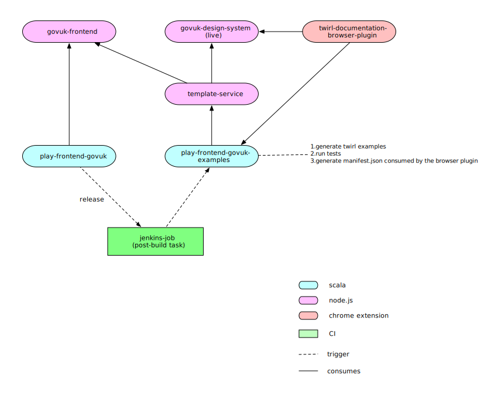

# play-frontend-govuk


> Twirl implementation of the [govuk-frontend](https://github.com/alphagov/govuk-frontend/) components library as 
  documented in the [GOV.UK Design System](https://design-system.service.gov.uk/components/). 

__This is a work in progress and for the time being we will be releasing versions 0.x.y which may have breaking changes.__


## Table of Contents

- [Background](#background)
- [Getting Started](#getting-started)
- [Usage](#usage)
- [API](#api)
- [Contributing](#contributing)
- [License](#license)

## Background

This library provides accessibility-compliant `Twirl` basic building blocks as originally implemented in the [govuk-frontend](https://github.com/alphagov/govuk-frontend/)
library. Additionally, it provides a layout that wraps the `GovukTemplate`, used across all frontends, and we plan to 
include more helpers built on top of `Play`'s own helpers and the basic components.
The following figure illustrates the components and their dependencies (zoom in for a better view).


## Getting Started

sbt
```sbt
//build.sbt for Play 2.5
libraryDependencies += "uk.gov.hmrc" %% "play-frontend-govuk" % "x.y.z-play-25"
//or Play 2.6
libraryDependencies += "uk.gov.hmrc" %% "play-frontend-govuk" % "x.y.z-play-26"
```

To use the [govuk-frontend](https://github.com/alphagov/govuk-frontend/) `Twirl` components and all the types needed 
to construct them, import the following:
```scala
import uk.gov.hmrc.govukfrontend.views.html.components._
```

The following import will bring the available `Twirl` helpers:
```scala
import uk.gov.hmrc.govukfrontend.views.html.helpers._
```

The following import will summon implicits that provide extension methods on `Play`'s [FormError](https://www.playframework.com/documentation/2.6.x/api/scala/play/api/data/FormError.html) 
to convert between `Play`'s form errors and view models used by `GovukErrorMessage` and `GovukErrorSummary`:
```scala
import uk.gov.hmrc.govukfrontend.views.html.components.implicits._
```

## Usage

The library is cross-compiled for `Play 2.5` and `Play 2.6`, the main difference between the two versions being that the latter
supports dependency injection of Twirl templates.

### Play 2.5

The namespace `uk.gov.hmrc.govukfrontend.views.html.components` exposes the components' templates as values with the prefix
`Govuk`, ex: a `govukButton` is available as `GovukButton`.

Ex: a disabled button
```scala
@import uk.gov.hmrc.govukfrontend.views.html.components._

@()
@GovukButton(Button(
  disabled = true,
  content = Text("Disabled button")
))
```

### Play 2.6

The same namespace exposes type aliases prefixed with `Govuk` (ex: the type `GovukButton`) so that components can be injected into 
a controller or template. It also exposes values of the same name (ex: `GovukButton`) if you wish to use the component template directly, 
though it is preferable to use dependency injection.

Same button using DI:
```scala
@import uk.gov.hmrc.govukfrontend.views.html.components._

@this(govukButton: GovukButton)

@()
@govukButton(Button(
  disabled = true,
  content = Text("Disabled button")
))
```

### Example Templates

We provide example templates using the Twirl components through a `Chrome` extension. Please refer to the 
[extension's github repository](https://github.com/hmrc/play-frontend-govuk-extension) for installation instructions.

With the extension installed, you should be able to go to the [GOV.UK Design System](https://design-system.service.gov.uk/components/), 
click on a component on the sidebar and see the `Twirl` examples matching the provided `Nunjucks` templates.

_Note: Currently there are examples only for the following components:_

* [Back link](https://design-system.service.gov.uk/components/back-link/) 
* [Button](https://design-system.service.gov.uk/components/button/)
* [Details](https://design-system.service.gov.uk/components/details/)
* [Error message](https://design-system.service.gov.uk/components/error-message/)
* [Error summary](https://design-system.service.gov.uk/components/error-summary/)
* [Fieldset](https://design-system.service.gov.uk/components/fieldset/)
* [Footer](https://design-system.service.gov.uk/components/footer/)
* [Header](https://design-system.service.gov.uk/components/header/)
* [Panel](https://design-system.service.gov.uk/components/panel/)
* [Radios](https://design-system.service.gov.uk/components/radios/)
* [Summary list](https://design-system.service.gov.uk/components/summary-list/)
* [Textarea](https://design-system.service.gov.uk/components/textarea/)
* [Text input](https://design-system.service.gov.uk/components/text-input/)

## API

TODO: link to scaladoc

## Contributing

### sbt Dependencies

The library depends on a `govuk-frontend` artifact published as a webjar.

```sbt
"org.webjars.npm" % "govuk-frontend" % "x.y.z"
```

Currently GDS does not automate the publishing of the webjar so it has to be manually published from [WebJars](https://www.webjars.org) after a `govuk-frontend` release.

The [following guide](/docs/upgrading.md) illustrates the process of updating the library when GDS releases a new version of `govuk-frontend`. 

### Unit Tests

The suite of unit tests runs against a set of test fixtures with data extracted from [govuk-frontend's yaml documentation](https://github.com/alphagov/govuk-frontend/blob/master/src/govuk/components/button/button.yaml)
for each component. The yaml examples are used in `govuk-frontend`'s own unit test suite. 

The test fixtures are generated from the release of `govuk-frontend` [used in the library](#sbt-dependencies). 
A script [TODO: document script] generates the fixtures which are manually included in the resources directory under `src/test/resources/fixtures/`.
The unit tests will pick up the fixtures folder matching the version of `govuk-frontend` in the dependencies.

_Future work: Given that unit testing the library using a fixed set of test fixtures provides only very basic coverage at best,
 if we can improve the test coverage via generative testing described on the next section, we could discard the test fixtures completely._ 

### Generative Testing

To ensure (as much as possible) that the implemented templates conform to the `govuk-frontend` templates, we use generative
testing, via `scalacheck`, to compare the `Twirl` templates output against the `Nunjucks` `govuk-frontend` templates.
Currently, the generative testing strategy has only been implemented as a proof of concept for two components: `GovukBackLink` and `GovukCheckboxes`.
 
The tests run against a `node.js` service used to render the `govuk-frontend` `Nunjucks` templates,
so you'll need to install it first.
To install `node.js` via `nvm` please follow the instructions [here](https://github.com/nvm-sh/nvm#installation-and-update).

To start the service before running integration tests:
```bash
git clone git@github.com:hmrc/template-service-spike.git

cd template-service-spike

npm install

npm start
```

Once the service is started on port 3000, you can run the integration tests:
```sbt
sbt it:test
```

_Note: The integration tests output produces a bit of noise as the library outputs statistics about the generators to check
the distribution of the test cases._

#### Reproducing Failures (Deterministic Testing)
In case of a test failure, the library outputs a seed that can be passed back to the failing test to reproduce it.

Ex:
```scala
object govukBackLinkTemplateIntegrationSpec
    extends TemplateIntegrationSpec[BackLink](
      govukComponentName = "govukBackLink", seed = Some("pass the seed here")) // pass the seed and re-run
```

Upon a test failure, the test reporter prints out a link to a diff file in `HTML` to easily compare the
markup for the failing test case against the expected markup. 

```scala
Diff between Twirl and Nunjucks outputs (please open diff HTML file in a browser): file:///Users/foo/dev/hmrc/play-frontend-govuk/target/govukBackLink-diff-2b99bb2a-98d4-48dc-8088-06bfe3008021.html
```

### Play 2.5 / Play 2.6 Cross-Compilation

With the implementation of 
[dependency injection for templates](https://www.playframework.com/documentation/2.6.x/ScalaTemplatesDependencyInjection), `Play 2.6`
introduced breaking changes in the syntax of `Twirl` templates.  For this reason, for every `Play 2.6` template implementing a component, we have
 to provide an almost identical `Play 2.5-compatible` template, differing only in the dependency injection declaration.

To automate this manual effort, the library uses an `sbt` task to auto-generate the `Play 2.5` templates from the `Play 2.6` ones:

```sbt
lazy val generatePlay25TemplatesTask = taskKey[Seq[File]]("Generate Play 2.5 templates")
```
  
* this task is a dependency for `twirl-compile-templates` in both `Compile` and `Test` configurations
* the auto-generated `Play 2.5` templates are not version controlled and should not be edited
* the `Play 2.5` templates for the examples consumed by the [Chrome extension plugin](https://github.com/hmrc/play-frontend-govuk-extension) are also auto-generated but they are version controlled

#### Naming Conventions for Injected Templates in Play 2.6

The automatic generation of `Play 2.5` templates works by stripping out the `@this` declaration
from a `Play 2.6` template.
This means that the name of an injected template should match the name of the `Twirl` template file that
implements it.

Ex: Given a hypothetical new component injecting `GovukInput` we should name the parameter `govukInput`.
When the `Play 2.5` auto-generated template gets compiled it is able to find the `govukInput` object
that implements the template (defined in the file `govukInput.scala.html`).
```scala
@this(govukInput: GovukInput)

@()
@govukInput(<params for govukInput template>)
```  

The auto-generated `Play 2.5` template will be:
```scala
@()
@govukInput(<params for govukInput template>)
```

`govukInput` is the name of the Scala object that implements the compiled `govukInput.scala.html` template.
Had we named the injected component something else, for example `input`, the auto-generated template would fail to compile
since there is no template named `input.scala.html`.

#### Backwards Compatibility in Play 2.6 Templates

Due to the aforementioned differences between the `Twirl` compilers in `Play 2.5` and `Play 2.6` and the auto-generation
feature, templates should not be written with backwards incompatible features only introduced in `Play 2.6`, such as
[@if else if](https://github.com/playframework/twirl/issues/33).

### Generating Example Templates (Future Work)

The library provides a set of manually created examples as [described above](#example-templates).
The examples are unit tested against the expected output `HTML` accompanying each example in the [GOV.UK Design System](https://design-system.service.gov.uk/components/)
to ensure the `Twirl` examples produce the same markup as the `Nunjucks` ones.
Once the examples are created, an `sbt` task is manually run to generate a [manifest.json](src/test/resources/manifest.json)
file that is consumed by the [Chrome extension]((https://github.com/hmrc/play-frontend-govuk-extension)) to display the examples
in the [GOV.UK Design System](https://design-system.service.gov.uk/components/).

We plan to extract the example generation to a separate project that will:
1. Generate the examples from the `Nunjucks` ones
2. Run the tests
3. Generate the `manifest.json` for the `Chrome` extension



TODO

## License

This code is open source software licensed under the [Apache 2.0 License]("http://www.apache.org/licenses/LICENSE-2.0.html").
