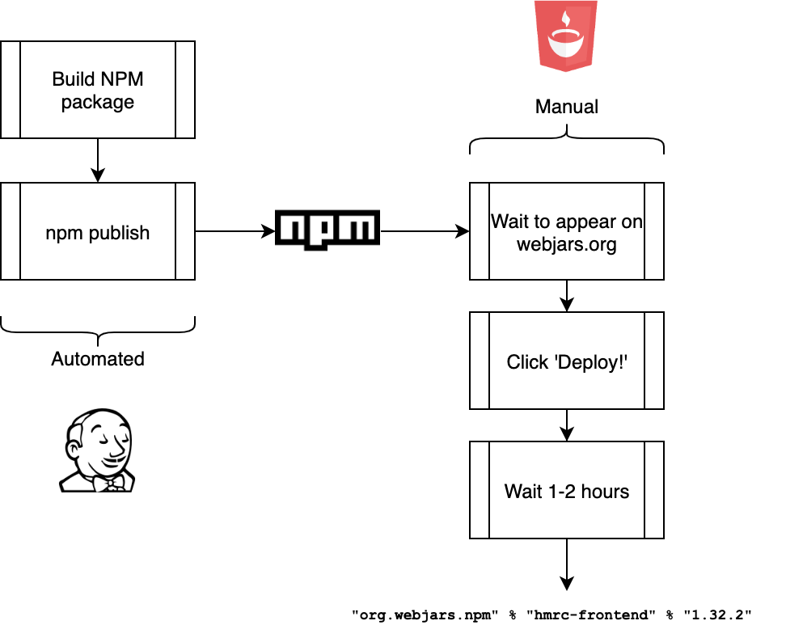
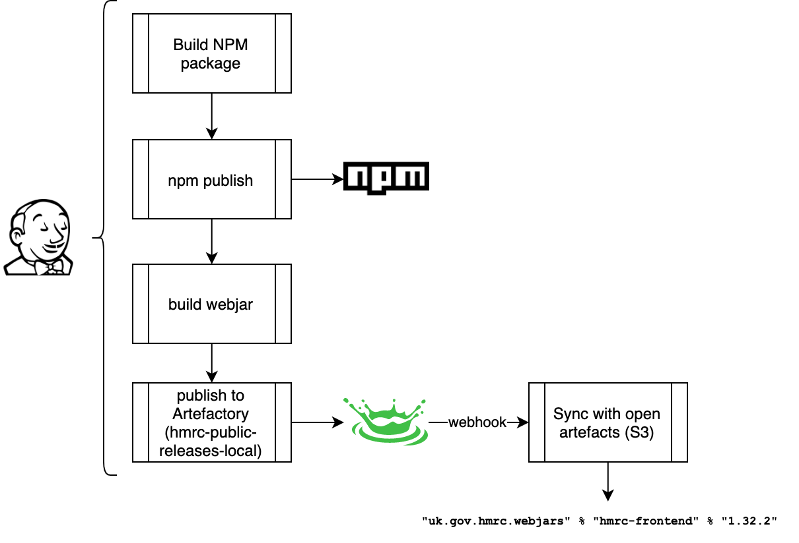

# Self-publish the hmrc-frontend webjar used by play-frontend-hmrc

* Status: accepted
* Date: 2020-06-07

Technical Story: PLATUI-1190

## Context and Problem Statement

play-frontend-hmrc relies on a webjar for [hmrc/hmrc-frontend](https://www.github.com/hmrc/hmrc-frontend)
published to www.webjars.org. This has a number of drawbacks:
* publishing is a manual process
* it can take many hours to complete
* webjars has been known to be down and HMRC has no support arrangements with www.webjars.org

The main impact of the above is an excessive lead time for making improvements in the
underlying hmrc-frontend library available in production via play-frontend-hmrc.

Bearing the above in mind, and the fact that HMRC has its own repository for open artefacts, replacing
Bintray, should we:

* automate the creation of the webjars within our own deployment pipelines with no dependency
  on webjars.org
* publish the resulting webjars to this repository automatically?

Note, this decision only addresses the creation and publishing of the hmrc-frontend webjar, not the
webjar for [alphagov/govuk-frontend](https://www.github.com/alphagov/govuk-frontend), which is 
currently a dependency for [hmrc/play-frontend-govuk](https://www.github.com/hmrc/play-frontend-govuk).

## Decision Drivers

* The need to make improvements and upgrades to hmrc-frontend 
  available in play-frontend-hmrc quickly.
* The increasing user base of play-frontend-hmrc, and accelerating demand for new features and
improvements.
* The hardship, frustration and toil the current manual process is causing the team.
* The need to keep things simple and avoidance of creating new repositories unnecessarily due to
  the overhead of maintaining those repositories
* The testing advantages of being able to build and deploy the hmrc-frontend webjar locally
* Parity between the hmrc-frontend NPM package and the webjar.

## Considered Options

* Option 1: do nothing
* Option 2: auto-create and deploy webjars to HMRC's open artefact repository using a gulp task in 
  hmrc-frontend operating on the generated package in `/package`
* Option 3: as option 2 but operating on the downloaded package from NPM instead
* Option 4: as option 2 but via a separate Github repository that has `hmrc-frontend` as a
dependency and operating on `node_modules/hmrc-frontend` instead

## Decision Outcome

Chosen option: option 2 because it solves the core issue and enables local testing without introducing 
additional dependencies.

### Existing architecture

### To be architecture

### Positive Consequences

* Webjars are available instantaneously after a new version of hmrc-frontend is released
* It is now possible to locally test changes to hmrc-frontend in conjunction with Scala microservices
without needing to publish to NPM or webjars.org first, reducing the risk that flawed components are released into 
  production.
* Lead times for making improvements to hmrc-frontend available in production are reduced.
* Maintaining play-frontend-hmrc is a less frustrating process.
* We have more control over the metadata attached to the webjars published. For example, at the moment, the webjars
  produced indicate webjars.org as the developer in the POM files.
* There are fewer external dependencies and moving parts.

### Negative Consequences

* We have an additional moving part to maintain ourselves.

## Pros and Cons of the Options

### Option 1

* Good, because no further work required
* Bad, because it doesn't solve the problem

### Option 2

* Good, because it's simple.
* Good, because it doesn't rely on a new Github repository
* Good, because it allows for local testing in Scala microservices
* Good, because parity with published NPM package – the `/package` subdirectory is a carbon copy
  of the published NPM package

### Option 3

* Good, because it more faithfully replicates the previous webjars.org functionality
* Bad, because it's more complex and requires more engineering and testing to extract from
  NPM e.g. timeouts/retries.
* Bad, because it precludes the possibility of local testing of the webjar in Scala microservices.

### Option 4

* Bad, because an additional repository is needed that will need maintaining and security patching.
* Bad, because additional wiring needed in Jenkins to kick off the webjar generation logic.
* Bad, because it precludes the possibility of local testing of the webjar in Scala microservices.
* Bad, because there is an additional step needed to bump the version of hmrc-frontend in the new 
  repository.
* Bad, because failures in webjar generation will not be picked up by PR status checks.
* Bad, because lack of parity with published NPM package. The package.json in 
  `node_modules/govuk-frontend` is different to the one published in NPM, it contains
  underscored properties that potentially contain sensitive CI-related information. However, we could 
  strip these out if necessary.

## Links

* https://www.webjars.org/documentation
* https://www.playframework.com/documentation/2.8.x/AssetsOverview
