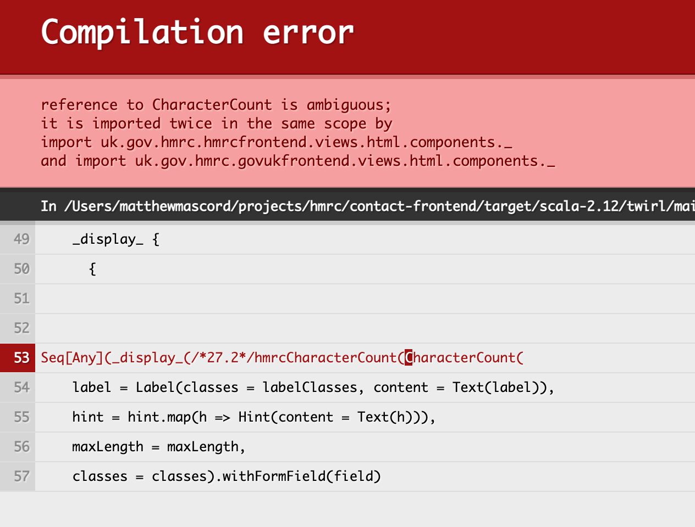

# Resolve naming collisions between libraries

* Status: accepted
* Deciders: platui
* Date: 2021-08-02

Technical Story: PLATUI-1237 (and related to this is PLATUI-1294)

## Context and Problem Statement

Given a service is using the twirl template imports recommended by the play-frontend libraries. When a developer tries
to use an import with a name which is present in both libraries without explicitly importing the one they want. Then
they will get a compilation error:

Currently, we recommend the use of the wildcard twirl imports, but this possible consequence is undocumented behaviour.
The compilation error can be resolved by explicitly importing the class they want.

## Decision Drivers

* Be unsurprising for developers (examples we give should be runnable without triggering an exception)
* As much as possible avoid breaking changes for existing services

## Considered Options

* **Option 1:** Documentation changes
    1. Add a note about the issue and explain how to resolve so that developers who run into this can unblock themselves
        * Will developers be able to find this easily enough when they need it?
    2. Stop recommending twirl key imports and instead ask for developers to use explicit imports
        * Will this have a negative impact on use of implicit helpers which may no longer be easily discoverable by
          developers?
            * Keep suggestion to wildcard import implicits, but not via twirl keys, do it in the template
            * Keep documentation about how they could use wildcard imports but with caveat of risk of collision
* **Option2:** API changes
    1. Do nothing
    2. Rename view models to make them unique between libraries
        * Will it actually be possible to add “Hmrc” or “Govuk” to the front of a view model or will that conflict with
          other classes in the libraries?
            * Our twirl components in views.html.components are compiled to classes with a lower case leading letter,
              like hmrcCharacterCount so we could rename our view models to HmrcCharacterCount, however we do currently
              alias HmrcCharacterCount to hmrcCharacterCount in components/package.scala. If teams import this rather
              than the lower case version then it’s going to be an ambiguous import and break when you try to compile
              it.
        * If it’s not possible, what else could we consider?
            * Rename with a new suffix like VM or ViewModel
                * And also adding the prefix to match the component?
        * Would we rename all the view models, or just those that conflict?
        * What would the impact of this be on services?
    3. Is it possible if both libraries are imported to prefer / override / exclude the govuk version when the hmrc is
       included - to include both via hmrc and omit the conflicted govuk versions

## Decision Outcome

We've decided to immediately implement Option 1.2 and defer further changes to be discussed as part of PLATUI-1294.

### Positive Consequences

* Less confusing for new developers where imports are coming from when we avoid recommending using TwirlKeys config. 
* Developers can see as part of our recommended usage instructions the possibility for an ambiguous import exception and
  what they can do to resolve them without.

### Negative Consequences

* Without an API change the naming of components and view models is not as intuitive as we think it could be which may
  confuse new developers.
