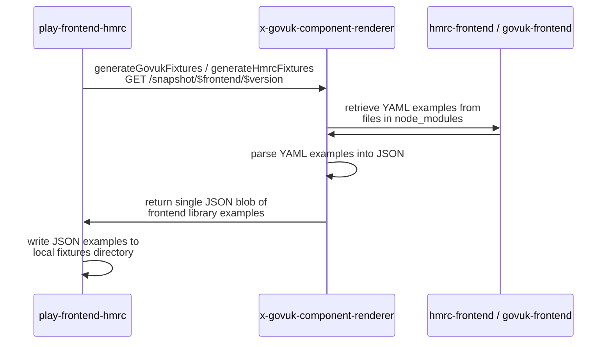
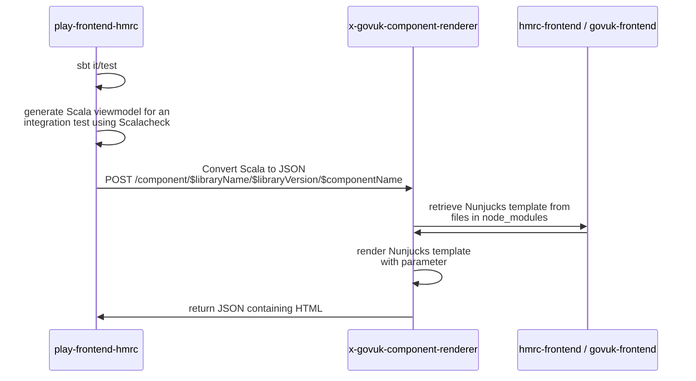

# Parsing and code generation within `play-frontend-hmrc` and `x-govuk-component-renderer`

## Overview
As mentioned in [Repository Maintenance Overview](overview.md) and [Upgrading play-frontend-hmrc](upgrading.md), the
tests within `play-frontend-hmrc` rely on generating HTML code based on the Nunjucks and YAML in `govuk-frontend` and 
`hmrc-frontend`.

## Use cases

### Generating unit tests fixtures

The HTML of the test fixtures is not strictly generated within `play-frontend-hmrc`. Rather than are rendered within 
x-govuk-component-renderer and are returned as a single blob of JSON from `x-govuk-component-renderer`.

The above task is run as a one-off when upgrading. Once the test fixtures have been generated for a releaes, the 
`x-govuk-component-renderer` is NOT called during the run of the tests via `sbt test`.

### Running integration tests

For integration tests, the Scalacheck library is used within `play-frontend-hmrc` to dynamically generate Scala viewmodel
instances. For each generated viewmodel, the Scala is then converted to JSON and `POST`-ed to `x-govuk-component-renderer`.
`x-govuk-component-rendered` will return a JSON containing the HTML rendered by the Nunjuck template for those JSON values,
which the integration test will compare to the HTML generated by the Scala viewmodel and Twirl template. The dynamically
generated HTML for both Nunjucks and Twirl templates is not persisted once an individual test has run.

