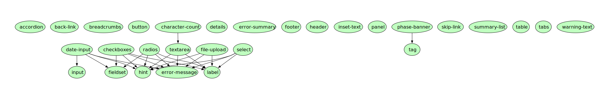

# Upgrading play-frontend-govuk

## Basic Steps

1. Go to [webjars.org](https://webjars.org) and add the govuk-frontend webjar by the following steps:
 - Click `Add a WebJar`
 - Select `WebJar Type` as `NPM`
 - Input `govuk-frontend` and select the relevant version from the dropdown
 - Hit `Deploy!`
2. Bump webjar [dependency](https://github.com/alphagov/govuk-frontend/tags) for `govuk-frontend` in `build.sbt`.
3. Generate and copy fixtures folder to test/resources/fixtures (this won't be necessary when we implement generative testing to increase test coverage).
   - Follow `Usage` steps in [x-frontend-snapshotter](https://github.com/dorightdigital/x-frontend-snapshotter)
   - Extract the contents of zip file `test-fixtures-[version-number].tar.gz` created in `target` and copy these to test/resources/fixtures/test-fixtures-[version-number] in this repo.
4. Run unit tests: `sbt clean test`.
5. Compare the two versions of `govuk-frontend` (outgoing vs incoming) using a diff tool as shown [below](#examining-components-for-failed-tests).

### Comparing Differences
Since some of the components have dependencies, it is easier to start upgrading by starting from components with no dependencies, or, alternatively, from the components on the bottom of the graph illustrated below, and work our way up.



We should first look at the components for which tests failed. It is also important to verify that there are no changes in the other components which were not flagged up by failing tests. Again, this situation might be mitigated by increasing test coverage with generative testing.

#### Examining Components for Failed Tests
 
For each failed test, make a diff between the revisions of the affected component for the old govuk-frontend version and the new one.

Ex: For upgrading from `v2.11.0` to `v3.2.0`: https://github.com/alphagov/govuk-frontend/compare/v2.11.0...v3.2.0

If there are many moved/renamed files, the heuristics used by git/github to detect such changes may not be accurate, and it is better to use an appropriate diff tool to perform the comparisons.

The important files to diff are the `.yaml` files describing the component's interface and the component's Nunjucks template implementation, usually named `template.njk`.

Ex:

Assuming we setup an appropriate diff tool to use with git, the following example shows how to diff the `.yaml` and `template.njk` files for a given component. Instructions for using `IntelliJ`’s diff and merge tool with `git` can be found [here](https://gist.github.com/rambabusaravanan/1d1902e599c9c680319678b0f7650898).

Given revisions for `govuk-frontend v2.11.0` of `8370f97` and `govuk-frontend v3.2.0` of `3ef1d76`:

```bash
git difftool 8370f97:src/components/accordion/accordion.yaml 3ef1d76:src/govuk/components/accordion/accordion.yaml

git difftool 8370f97:src/components/accordion/template.njk 3ef1d76:src/govuk/components/accordion/template.njk
```

#### Looking at Other Components

Now we should verify all the other components for differences and improve test coverage in case those differences were
not detected by the tests.

Ex: For the `file-upload` component there was a new parameter added but none of the test cases detected the change because 
of insufficient test coverage.
```bash
git diff 8370f97:src/components/file-upload/file-upload.yaml                 3ef1d76:src/govuk/components/file-upload/file-upload.yaml
```

```diff
diff --git a/src/components/file-upload/file-upload.yaml b/src/govuk/components/file-upload/file-upload.yaml
index 51d2d346..713db75d 100644
--- a/src/components/file-upload/file-upload.yaml
+++ b/src/govuk/components/file-upload/file-upload.yaml
@@ -11,6 +11,10 @@ params:
   type: string
   required: false
   description: Optional initial value of the input
+- name: describedBy
+  type: string
+  required: false
+  description: One or more element IDs to add to the `aria-describedby` attribute, used to provide additional descriptive information for screenreader users.
 - name: label
   type: object
   required: true
```


